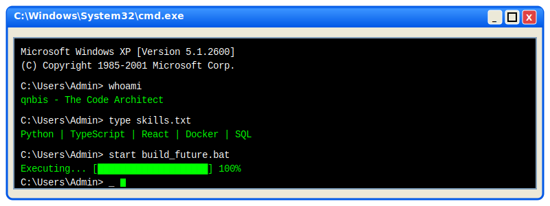
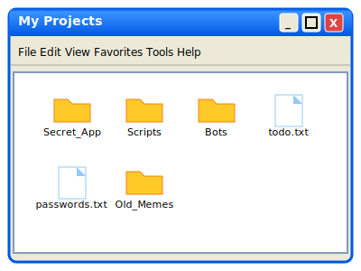
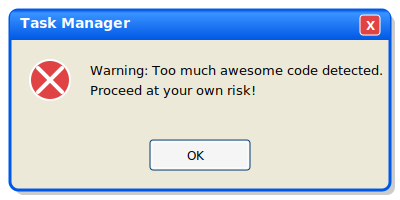
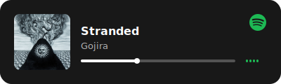

  

 

  <table>
    <tr>
      <td align="center" style="border:none;">
        
      </td>
      <td align="center" style="border:none;">
        
      </td>
    </tr>
  </table>

 

  
  

 

  <h3>🎵 Winamp Player (Just Kidding, it's Spotify) 🎵</h3>
  

 

  

 

  

